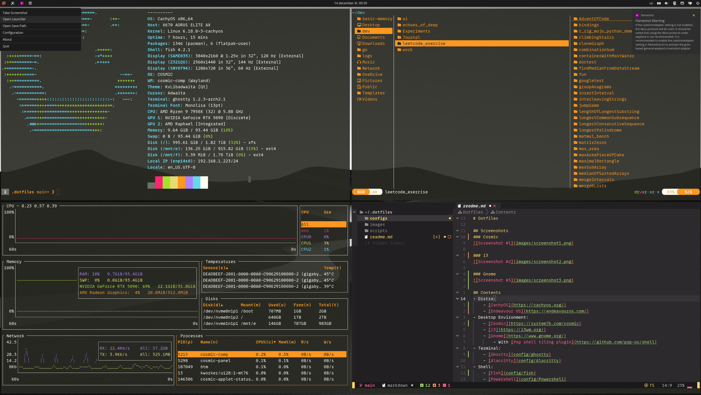
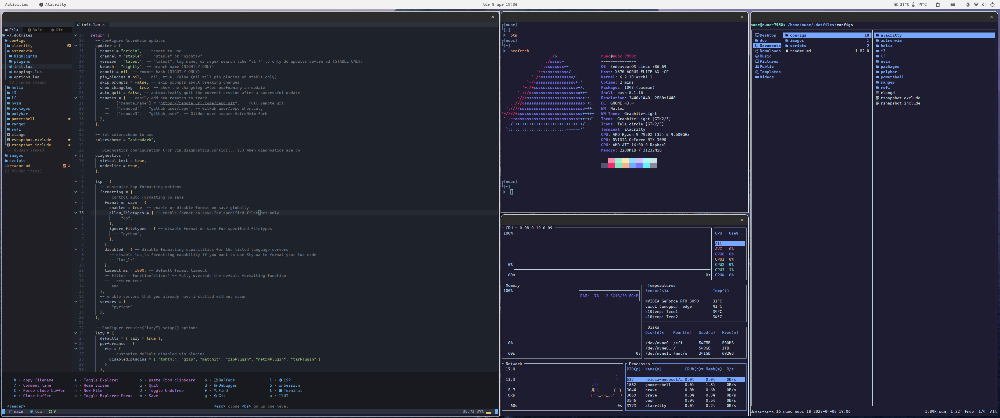

# Dotfiles

## Screenshots
### Cosmic

### i3

### Gnome

## Contents
- Distro:
    - [CachyOS](https://cachyos.org/)
    - [Endeavour OS](https://endeavouros.com/)
- Desktop Environment:
    - [Cosmic](https://system76.com/cosmic)
    - [i3](https://i3wm.org/)
    - [Gnome](https://www.gnome.org/)
        - With [Pop shell tiling plugin](https://github.com/pop-os/shell)
- Terminal:
    - [Ghostty](config/ghostty)
    - [Alacritty](config/Alacritty)
- Shell:
    - [Fish](config/fish)
    - [Powershell](config/Powershell)
    - With [Oh-my-posh powerline](https://ohmyposh.dev/)
- Editor: 
    - [Neovim](https://neovim.io/):
        - [AstroNvim](https://astronvim.com/) with [config](config/AstroNvim)
        - [Custom config](config/nvim) based on [kickstart.nvim](https://github.com/nvim-lua/kickstart.nvim),
    - [Helix](https://helix-editor.com/):
    - [VsCode](https://code.visualstudio.com/)
- File browser:
    - [yazi](https://yazi-rs.github.io/)
    - (Linux) [ranger](https://github.com/ranger/ranger)
    - (Windows) [lf](https://github.com/gokcehan/lf)
- Process Monitor:
    - [Bottom](https://github.com/ClementTsang/bottom)
    - [Oxker](https://github.com/mrjackwills/oxker)
- App launcher:
    - [Rofi](https://github.com/davatorium/rofi)
- Finder:
    - [fd](https://github.com/sharkdp/fd)
    - [ripgrep](https://github.com/BurntSushi/ripgrep)
    - (Windows) [Everything](https://www.voidtools.com/downloads/)
- Themes:
    - (Gnome)[Graphite-gtk-theme](https://github.com/vinceliuice/Graphite-gtk-theme)
    - (Gnome)[Orchis-theme](https://github.com/vinceliuice/Orchis-theme)
    - (Icon) [Tela Circle Icon Theme](https://github.com/vinceliuice/Tela-circle-icon-theme)
    - (Cursor)[Oreo Cursors](https://github.com/varlesh/oreo-cursors)
    - (colorscheme)[Embark](https://github.com/embark-theme/vim)
    - (colorscheme)[Everforest](https://github.com/sainnhe/everforest)
- Journal Note taking:
    - [Blinko](https://github.com/blinkospace/blinko)
    - [LogSeq](https://logseq.com/)
    - [Obsidian](https://obsidian.md/)

